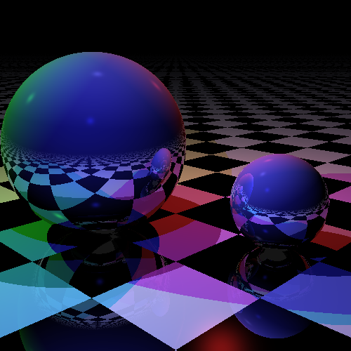

# crystal_ray_tracer

This is an example shard for use in generating ray-traced images.

It is a Reorganization of [jzakiya](https://forum.crystal-lang.org/u/jzakiya)'s ported-from-Ruby code into a Crystal-lang 'shard' library.

It is for sake of use in https://github.com/edin/raytracer under the `crystal` sub-folder; also for re-use elsewhere, as this is a shard.

## Installation

1. Add the dependency to your `shard.yml`:

   ```yaml
   dependencies:
     crystal_ray_tracer:
       github: your-github-user/crystal_ray_tracer
   ```

2. Run `shards install`

## Usage

```crystal
require "crystal_ray_tracer"
```

TODO: Write usage instructions here

## Examples

### Build the example app

For a quick, simpler build to test this out, enter:
`crystal build examples/jzakiya.cr -o examples/jzakiya`

For a longer, more advanced build to get better performance, enter:
`crystal build examples/jzakiya.cr -o examples/jzakiya --release`

This doesn't (at least not yet) make much use of multi-threaded fibers, but you can enable it like this:
`crystal build examples/jzakiya.cr -o examples/jzakiya --release -Dpreview_mt`

The compiled file will be in the `examples` folder or what ever you specify after the `-o` option.

### Run the example app

`examples/jzakiya`

This will generate the example image (based on the image used for https://github.com/edin/raytracer) called `crystal-raytracer.png` in (for now) the root of the repo.

This file will look like:



(Using the `--release` flag makes it generate the image significantly faster than the un-optimized compilation. On my system including '--release', makes it run about 12 times faster.)

## Development

TODO: Write development instructions here

## Contributing

1. Fork it (<https://github.com/your-github-user/crystal_ray_tracer/fork>)
2. Create your feature branch (`git checkout -b my-new-feature`)
3. Commit your changes (`git commit -am 'Add some feature'`)
4. Push to the branch (`git push origin my-new-feature`)
5. Create a new Pull Request

## Contributors

- [Jabari Zakiya](https://forum.crystal-lang.org/u/jzakiya) - Ported and optimized Ruby code to Crystal-lang (See: https://forum.crystal-lang.org/t/doing-raytracer-in-crystal/3029)
- [Daniel Huffman](https://github.com/your-github-user) - Repo creator and maintainer - Helping reorganize Crystal code
